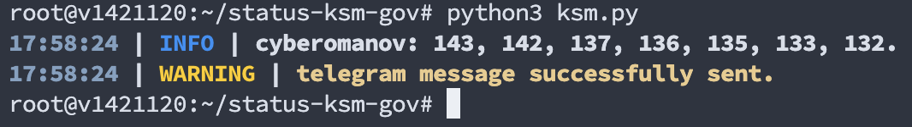
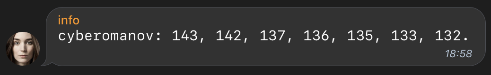

# KSM-GOV

this system will alert you with telegram about your unvoted kusama proposals.<br>
[donations are welcome](https://cyberomanov.tech/WTF_donate), if you find this tool helpful.

## Contents
1. [Screenshots](https://github.com/cyberomanov/status-ksm-gov#screenshots)
2. [Installation](https://github.com/cyberomanov/status-ksm-gov#installation)
3. [Update](https://github.com/cyberomanov/status-ksm-gov#update)

### Screenshots

<p align="center">Log example:</p>
<p align="center">

<br> <br>

<br> <br>
</p>

### Installation

1. Create telegram bot via `@BotFather`, customize it and get `bot_API_token` ([how_to](https://www.siteguarding.com/en/how-to-get-telegram-bot-api-token)).
2. Create at least 1 chat: `ksm-gov`. Customize it, add your bot into the chat and get `chat_ID` ([how_to](https://stackoverflow.com/questions/32423837/telegram-bot-how-to-get-a-group-chat-id)).
3. Connect to your server where you plan to install `ksm-gov-status-system`.
4. Install `python3.10` or newer:
```
python3 -V

>>> Python 3.10.9
```
5. Clone this repository:
```
cd ~/ && \
git clone https://github.com/cyberomanov/status-ksm-gov.git status-ksm-gov && \
cd ~/status-ksm-gov/
```
6. Install requirements:
```
pip3 install -r ~/status-ksm-gov/requirements.txt
```
7. Edit `config.yaml`:
```
nano ~/status-ksm-gov/config.yaml
```
8. Run the `ksm.py` to check you config settings:
```
python3 ksm.py
```
9. If all seems okay, then edit your crontab with `crontab -e`:
```
# ksm-gov
0 */6 * * * cd /root/status-ksm-gov/ && /usr/bin/python3 ksm.py
```
> check your logs in several hours here: `~/status-ksm-gov/log/ksm.log`
---------
### Update

1. backup your config:
```
cp ~/status-ksm-gov/config.yaml ~/config_temp.yaml
```
2. pull changes from the repository:
```
cd ~/status-ksm-gov/ && \
git fetch && \
git reset --hard && \
git pull
```
3. print a new default config:
```
cat ~/status-ksm-gov/config.yaml
```
4. restore your previous config, **ONLY** if there is no breaking changes, else edit the new file:
```
nano ~/status-ksm-gov/config.yaml

OR

mv ~/config_temp.yaml ~/status-ksm-gov/config.yaml
```
5. Install requirements:
```
pip3 install -r ~/status-ksm-gov/requirements.txt
```
6. Run the `ksm.py` to check you config settings:
```
python3 ksm.py
```
